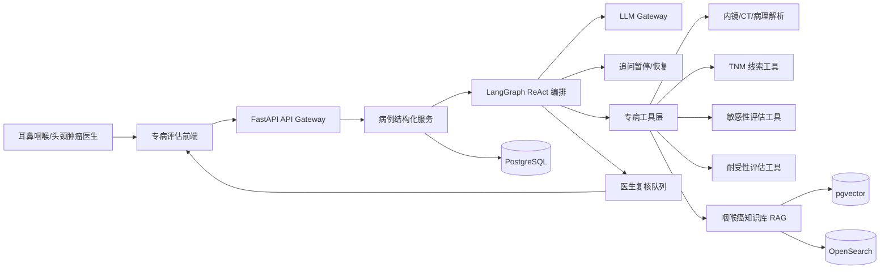
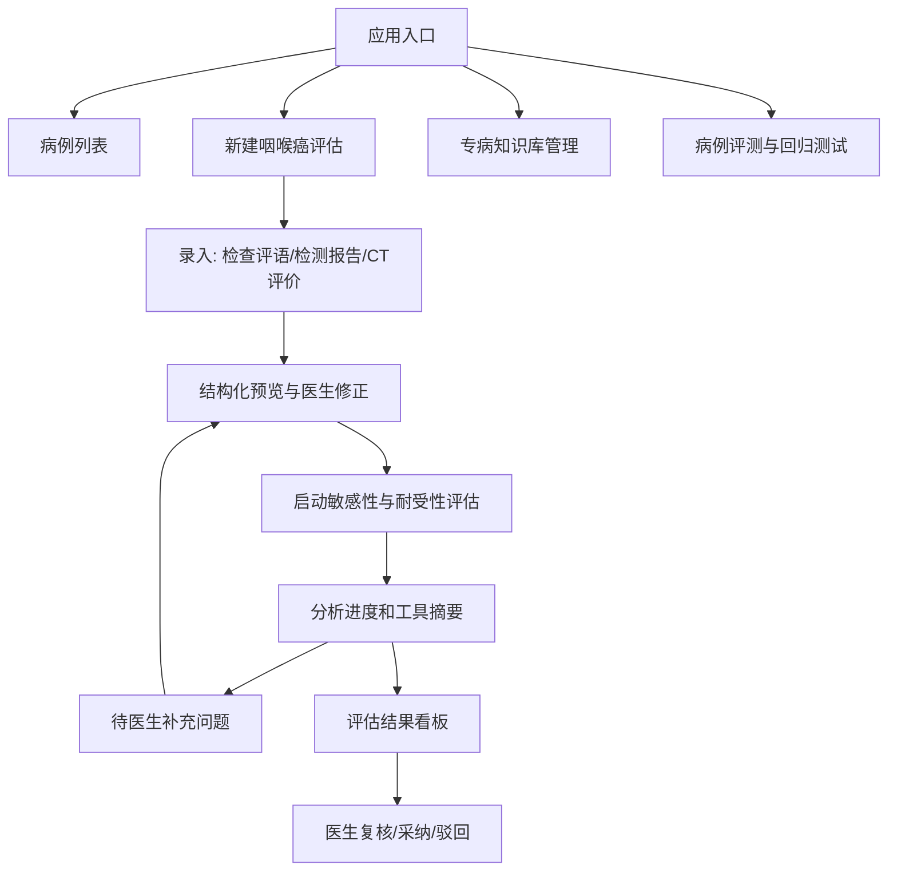
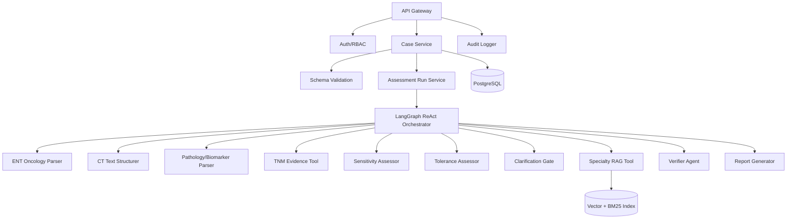
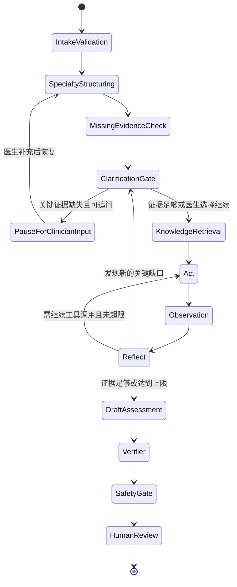

# 咽喉癌敏感性与耐受性评估 Agent 前后端设计方案

版本: v0.2  
定位: 面向耳鼻咽喉头颈肿瘤医生的专病辅助评估 Agent。  
核心输出: 咽喉癌相关诊断证据整理、分期线索、治疗敏感性评估、治疗耐受性评估。

## 1. 目标与边界

本系统不再面向所有医疗诊断场景，只聚焦咽喉癌相关病例。输入主要包括医生检查评语、检测报告文本、CT 文字评价和补充知识库，输出面向医生复核的“敏感性”和“耐受性”辅助评估。

这里的“敏感性”指对放疗、铂类化疗、免疫治疗、靶向治疗等治疗方向的可能获益倾向；“耐受性”指患者基于体能状态、器官功能、营养状况、气道风险、合并症和既往治疗史，对相关治疗的可承受程度。Agent 不能直接开具治疗方案、药物剂量或替代 MDT 决策。

关键边界:

- 咽喉癌最终确诊通常依赖病理。若缺少病理或细胞学证据，只能输出“疑似/高度疑似/证据不足”，不能输出“已确诊”。
- 当前版本只处理文本，不直接读取原始 CT、MRI、内镜图片或病理切片。
- Agent 输出为临床辅助评估，必须由医生复核后使用。
- 当关键证据不足且该证据可由医生补充时，Agent 应暂停评估并发起结构化追问，而不是强行给出低置信度结论。
- LLM 负责文本理解、证据归纳、知识匹配和报告生成；分期规则、结构化 schema 校验、参考区间、权限、审计、版本绑定等确定性任务由代码完成。
- 系统展示证据链和工具调用摘要，不展示隐藏 chain-of-thought。

## 2. 输入范围

### 2.1 医生检查评语

包括但不限于:

- 喉镜、鼻咽镜、口咽检查、间接喉镜、电子喉镜记录。
- 肿物位置、大小、形态、溃疡、出血、坏死、表面粗糙、边界、活动度。
- 声带活动、喉腔狭窄、吞咽困难、声音嘶哑、疼痛、异物感。
- 颈部淋巴结触诊、气道受压或梗阻风险描述。

### 2.2 检测报告文本

包括但不限于:

- 病理: 鳞癌、腺癌、未分化癌、癌前病变、分化程度、浸润情况、切缘。
- 免疫组化/分子: p16、HPV、EBV/EBER、PD-L1 CPS/TPS、Ki-67、EGFR 等。
- 实验室: 血常规、肝肾功能、电解质、凝血、白蛋白、炎症指标、甲状腺功能。
- 既往治疗与不良反应: 放疗史、化疗史、免疫治疗史、手术史。

### 2.3 CT 文字评价

包括但不限于:

- 原发灶部位、范围、最大径、强化方式。
- 会厌、声门、声门上/下区、梨状窝、咽后壁、舌根、扁桃体、鼻咽等受累描述。
- 甲状软骨/环状软骨侵犯、喉旁间隙、会厌前间隙、椎前筋膜、颈动脉鞘受累。
- 颈部淋巴结分区、短径、坏死、包膜外侵犯疑似、双侧性。
- 远处转移线索或胸部/腹部检查摘要。

### 2.4 知识库输入

知识库应支持版本化，来源建议包括:

- 院内头颈肿瘤诊疗规范和 MDT 共识。
- CSCO/NCCN/ESMO 等指南中与咽喉癌、喉癌、下咽癌、口咽癌、鼻咽癌相关章节。
- TNM 分期规则、影像评估模板、病理报告模板。
- 放疗、同步放化疗、诱导化疗、免疫治疗、靶向治疗的适应证、禁忌证和风险因素。

## 3. 输出定义

核心输出不再是泛化“诊断结果”，而是结构化的专病评估:

1. 病例摘要
   - 原发部位、症状、关键内镜/查体发现、CT 要点、病理/标志物、实验室异常。

2. 诊断与分期线索
   - 咽喉癌可能性、病理确认状态、疑似解剖亚部位、TNM 线索和缺失项。

3. 敏感性评估
   - 放疗敏感性。
   - 铂类化疗敏感性。
   - 免疫治疗敏感性。
   - 靶向治疗敏感性。
   - 每项输出等级、依据、反证、缺失检查、知识库引用。

4. 耐受性评估
   - 放疗耐受性: 营养、吞咽、口腔黏膜、既往放疗、气道风险。
   - 化疗耐受性: 骨髓、肝肾功能、听力/神经毒性风险、ECOG、年龄与合并症。
   - 免疫治疗耐受性: 自身免疫病、感染、器官移植、肝炎/肺炎风险。
   - 手术/麻醉相关耐受性: 气道、心肺功能、营养状态，仅作为风险提示。

5. 暂停追问
   - 当缺失项会改变关键结论时，输出 `paused_for_clinician_input` 状态。
   - 追问必须具体、可回答、可操作，例如“请补充最近一次肌酐/eGFR”“请确认是否存在喘鸣或静息呼吸困难”“请补充病理是否已证实鳞癌”。
   - 医生补充后，Agent 从同一 assessment_run 恢复，保留前序证据和审计记录。

6. 缺失信息
   - 例如缺少病理、p16/HPV、PD-L1、ECOG、白蛋白、肾功能、完整 CT 分期、颈部淋巴结分区。

7. 医生复核声明
   - 输出必须标记 review_required = true。

## 4. 推荐技术栈

| 层级 | 推荐选择 | 说明 |
| --- | --- | --- |
| 前端 | Next.js + React + TypeScript | 构建专病病例录入、流式分析和评估看板 |
| UI | Tailwind CSS + shadcn/ui + React Hook Form + Zod | 医生可修正结构化抽取结果，前后端 schema 对齐 |
| 前端状态 | TanStack Query + Zustand | 服务端病例状态和本地录入草稿分离 |
| 后端 API | Python FastAPI + Pydantic | 适合结构化医疗 schema、异步任务和 OpenAPI |
| Agent 编排 | LangGraph | 适合 ReAct 状态机、工具白名单、人工复核节点 |
| LLM 适配 | LiteLLM / OpenAI-compatible client | 支持云模型、私有模型和模型降级 |
| 知识库 | PostgreSQL + pgvector + OpenSearch | 向量召回和 BM25 同时保留，MVP 先用 pgvector |
| 规则引擎 | Python rule modules / durable_rules | TNM 线索、耐受性硬阈值、禁忌证使用确定性规则 |
| 异步任务 | Redis + Celery/RQ | 长任务、知识库索引、批量评测 |
| 对象存储 | S3/MinIO | 保存原始文本、脱敏文本、导出报告 |
| 安全 | OIDC/JWT + RBAC + KMS/Vault | 医生、审核员、知识库管理员分权 |
| 观测 | OpenTelemetry + Prometheus + Grafana + Loki | 追踪 LLM、工具、知识库版本和失败案例 |

## 5. 总体架构图



## 6. 前端设计

### 6.1 页面结构



### 6.2 录入表单

建议按标签页组织:

- 基础信息: 年龄、性别、吸烟饮酒史、ECOG、体重变化、合并症。
- 医生评语: 内镜/查体原文、症状持续时间、气道风险。
- CT 评价: 原文粘贴、检查日期、检查部位、是否增强。
- 病理与标志物: 病理类型、分化程度、p16/HPV、EBV/EBER、PD-L1、Ki-67。
- 实验室: 血常规、肝肾功能、电解质、凝血、白蛋白、甲功。
- 既往治疗: 手术、放疗、化疗、免疫/靶向治疗及不良反应。

### 6.3 结构化预览

LLM 抽取后必须进入医生可编辑的结构化预览页。重点字段:

- cancer_site: nasopharynx、oropharynx、hypopharynx、larynx、unknown。
- pathology_status: confirmed、suspicious、not_available。
- ct_extent: 原发灶范围、软骨侵犯、间隙侵犯、淋巴结情况。
- biomarkers: p16、HPV、EBV、PD-L1、Ki-67、EGFR。
- tolerance_factors: ECOG、白蛋白、肾功能、肝功能、骨髓储备、气道风险、营养风险。

### 6.4 结果看板

结果页建议分为四个区域:

- 诊断证据卡: 病理确认状态、疑似亚部位、分期线索、主要证据。
- 敏感性矩阵: 放疗、铂类化疗、免疫治疗、靶向治疗，每项显示等级、依据、反证、缺失项。
- 耐受性矩阵: 放疗、化疗、免疫治疗、手术/麻醉，每项显示 good、caution、poor、unknown。
- 知识引用与医生复核: 引用来源、知识库版本、模型版本、复核操作。

### 6.5 证据不足追问交互

当后端返回 `paused_for_clinician_input` 时，前端不展示最终评估结论，而是展示“待医生补充”面板:

- 问题按优先级排序，每次建议 1 到 5 个问题，避免一次性追问过多。
- 每个问题必须说明用途，例如“用于判断铂类化疗耐受性”或“用于确认是否存在气道急症风险”。
- 问题类型支持 yes_no、single_select、multi_select、number、date、free_text、report_upload。
- 医生可以回答、标记未知、上传报告文本，或选择“无法补充，继续低置信度评估”。
- 医生提交后调用恢复接口，Agent 使用原 run 的上下文继续执行。

## 7. 后端设计

### 7.1 后端模块



### 7.2 服务职责

- Case Service: 管理病例、原始输入、结构化结果、医生修订版本。
- Assessment Run Service: 创建敏感性/耐受性评估任务，管理状态和事件流。
- Specialty RAG Service: 检索咽喉癌指南、院内规范、TNM 规则和治疗风险知识。
- Rule Service: 执行确定性规则，例如肾功能不全对铂类耐受性的硬性提示。
- Clarification Service: 生成、保存、展示医生追问，并在医生补充后恢复原评估任务。
- Verifier Agent: 审查证据是否支持结论、是否误把疑似病例写成确诊。
- Safety Guard: 禁止处方剂量、自动治疗方案、绕过医生复核。
- Audit Service: 记录输入、结构化修改、工具调用摘要、模型版本、知识库版本。

## 8. ReAct Agent 结构

可以继续使用 ReAct，但要收敛为“专病受限 ReAct”:



### 8.1 工具白名单

| 工具 | 是否 LLM | 用途 |
| --- | --- | --- |
| ent_exam_parser | 是 | 抽取内镜/查体中的肿瘤部位、大小、侵犯、气道风险 |
| ct_report_structurer | 是 | 抽取 CT 原发灶、侵犯范围、淋巴结、转移线索 |
| pathology_biomarker_parser | 是 | 抽取病理类型、分化、p16/HPV/EBV/PD-L1 等 |
| lab_tolerance_checker | 混合 | 检查血常规、肝肾功能、白蛋白、凝血等耐受性因素 |
| tnm_evidence_mapper | 混合 | 映射 TNM 线索，只输出线索和缺失项，不替代医生分期 |
| specialty_rag_search | 混合 | 检索咽喉癌专病知识库 |
| clarification_question_generator | 是 | 将关键证据缺口转成医生可回答的问题 |
| sensitivity_assessor | 是 | 基于证据生成治疗方向敏感性评估 |
| tolerance_assessor | 混合 | 基于规则和 LLM 生成治疗耐受性评估 |
| contradiction_checker | 是 | 检查病理、CT、内镜、实验室之间的矛盾 |
| report_generator | 是 | 生成结构化评估报告 |
| output_schema_validator | 否 | 校验最终 JSON/Markdown |

### 8.2 运行规则

- 最大 ReAct 循环次数: 4 到 6 轮。
- 每轮只能调用白名单工具。
- 每个结论必须引用病例证据或知识库证据。
- 缺少病理时，不能输出确诊，只能输出疑似程度和建议补充病理。
- 缺少关键标志物时，免疫/靶向敏感性应降级为 uncertain 或 not_supported。
- 若关键缺失项可由医生立即补充，应优先进入暂停追问，而不是直接生成最终报告。
- 暂停追问不计入失败；assessment_run 状态应置为 `paused_for_clinician_input`。
- 输出不能包含药物剂量、疗程安排、具体处方。
- 发现气道危急、出血、严重吞咽障碍、重度营养不良等，应优先输出 urgent/emergency 风险。

### 8.3 暂停追问机制

Clarification Gate 负责决定是否暂停。暂停条件同时满足以下三点:

- 缺失证据会直接影响敏感性、耐受性、红旗风险或病理确认状态。
- 该证据可以由医生通过观察、补充报告、确认病史或上传文本获得。
- 当前继续评估会导致结论明显不稳定，或只能给出大量 unknown。

典型追问:

- 病理确认: “是否已有病理或细胞学结果？如有，请补充病理类型和分化程度。”
- 免疫敏感性: “是否有 PD-L1 CPS/TPS、p16/HPV、EBV/EBER 结果？”
- 化疗耐受性: “请补充最近一次肌酐/eGFR、血常规、肝功能。”
- 放疗耐受性: “是否存在严重吞咽困难、误吸、明显体重下降或既往头颈部放疗史？”
- 气道风险: “是否存在喘鸣、静息呼吸困难、喉腔明显狭窄或近期窒息发作？”

追问对象应是医生，不是患者。追问内容必须以结构化 JSON 保存，并进入审计日志。

## 9. 数据模型草案

| 表 | 关键字段 |
| --- | --- |
| users | id, role, department, license_status, oidc_subject |
| cases | id, patient_pseudo_id, cancer_site, creator_id, status, created_at |
| case_inputs | id, case_id, input_type, raw_text_ref, normalized_json, version |
| specialty_structures | id, case_id, ent_exam_json, ct_json, pathology_json, lab_json, edited_by |
| assessment_runs | id, case_id, model_version, kb_version, prompt_version, status, paused_reason |
| clarification_requests | id, run_id, status, priority, reason, questions_json, created_at, answered_at |
| clarification_responses | id, request_id, responder_id, answers_json, attached_input_ids, created_at |
| run_events | id, run_id, event_type, tool_name, summary, payload_hash, created_at |
| assessment_reports | id, run_id, report_json, report_markdown, overall_confidence |
| sensitivity_items | id, report_id, modality, level, evidence_json, missing_json |
| tolerance_items | id, report_id, modality, level, risk_factors_json, missing_json |
| citations | id, report_id, source_id, title, section, snippet_hash |
| reviews | id, report_id, reviewer_id, decision, comment, signed_at |
| audit_events | id, actor_id, action, resource_type, resource_id, metadata, created_at |

## 10. API 草案

```http
POST /api/cases
GET  /api/cases/{case_id}
POST /api/cases/{case_id}/inputs
POST /api/cases/{case_id}/structure-specialty
POST /api/cases/{case_id}/assessment-runs
GET  /api/assessment-runs/{run_id}
GET  /api/assessment-runs/{run_id}/events
GET  /api/assessment-runs/{run_id}/clarification-requests
POST /api/clarification-requests/{request_id}/responses
POST /api/assessment-runs/{run_id}/resume
GET  /api/assessment-runs/{run_id}/report
POST /api/assessment-reports/{report_id}/review
POST /api/knowledge/documents
GET  /api/knowledge/versions
GET  /api/audit-events
```

## 11. 报告 JSON Schema 草案

```json
{
  "case_id": "string",
  "assessment_status": "completed | paused_for_clinician_input",
  "summary": "string",
  "pending_clarification": {
    "request_id": "string",
    "reason": "string",
    "questions": [
      {
        "id": "string",
        "priority": "high | medium | low",
        "question": "string",
        "expected_answer_type": "yes_no | single_select | multi_select | number | date | free_text | report_upload",
        "clinical_purpose": "string",
        "blocks_conclusion": true
      }
    ]
  },
  "diagnostic_evidence": {
    "cancer_site": "nasopharynx | oropharynx | hypopharynx | larynx | unknown",
    "pathology_status": "confirmed | suspicious | not_available",
    "pathology_type": "string",
    "stage_clues": ["string"],
    "missing_for_staging": ["string"]
  },
  "sensitivity_assessment": [
    {
      "modality": "radiotherapy | platinum_chemo | immunotherapy | targeted_therapy",
      "level": "likely_sensitive | possible_sensitive | uncertain | not_supported",
      "supporting_evidence": ["string"],
      "contradicting_evidence": ["string"],
      "missing_information": ["string"],
      "citations": ["string"]
    }
  ],
  "tolerance_assessment": [
    {
      "modality": "radiotherapy | chemotherapy | immunotherapy | surgery_anesthesia",
      "level": "good | caution | poor | unknown",
      "risk_factors": ["string"],
      "protective_factors": ["string"],
      "missing_information": ["string"]
    }
  ],
  "red_flags": ["string"],
  "recommended_missing_tests": ["string"],
  "knowledge_version": "string",
  "model_version": "string",
  "review_required": true,
  "disclaimer": "本结果仅用于医生辅助评估，不能替代病理诊断、MDT 决策、治疗处方或急救处置。"
}
```

## 12. 知识库设计

知识库文档建议切分为以下类型:

- guideline: 指南与共识。
- staging_rule: TNM 分期规则。
- imaging_template: CT/MRI/内镜结构化评估模板。
- pathology_template: 病理与免疫组化模板。
- sensitivity_rule: 治疗敏感性相关证据。
- tolerance_rule: 治疗耐受性、禁忌证和风险因素。
- hospital_protocol: 院内流程与 MDT 规则。

每条知识应包含:

- source_title、source_type、version、publish_date。
- cancer_site_scope。
- applicable_population。
- evidence_level。
- text_chunk。
- structured_tags。
- owner 和审核状态。

## 13. MVP 里程碑

1. MVP-0 专病原型
   - 输入医生评语、检测报告、CT 文字评价。
   - 输出敏感性和耐受性 JSON/Markdown 报告。
   - 使用静态知识库和 LangGraph ReAct。

2. MVP-1 医生闭环
   - 加入结构化预览、证据不足暂停追问、医生补充后恢复、复核采纳/驳回。
   - 加入 SSE 流式进度和工具调用摘要。

3. MVP-2 知识库与评测
   - 加入知识库版本管理、引用溯源、标准病例回归评测。
   - 加入误把疑似当确诊、缺少病理仍给强结论等安全测试。

4. MVP-3 院内部署
   - OIDC/RBAC/KMS、私有化部署、审计报表。
   - 与 EMR/PACS 仅做文本摘要输入对接，不自动写回正式病历。

## 14. 关键风险与控制

| 风险 | 控制方式 |
| --- | --- |
| 缺少病理却输出确诊 | pathology_status 强校验，verifier 拦截 |
| 证据不足仍强行输出结论 | Clarification Gate 暂停追问，医生可补充或选择低置信度继续 |
| 敏感性评估过度确定 | 等级限定为倾向性表达，必须列缺失信息 |
| 耐受性忽略器官功能 | lab_tolerance_checker 使用确定性规则 |
| CT/内镜/病理互相矛盾 | contradiction_checker 强制输出冲突项 |
| 知识库过期 | 知识版本绑定，报告显示知识库版本 |
| 输出治疗处方 | safety_gate 禁止剂量、疗程、自动医嘱 |
| 医生过度依赖 | UI 强制显示辅助定位、医生复核和反证 |
